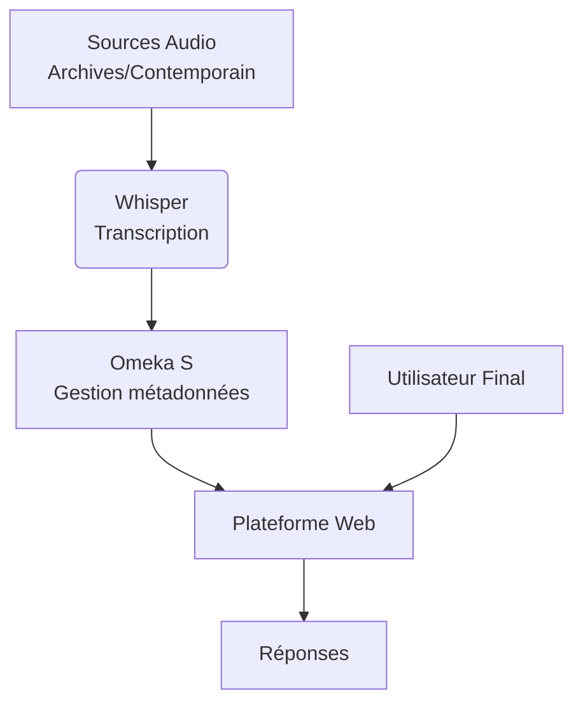

# Mémoire Sonore


## Présentation

**Mémoire Sonore** est une plateforme qui permet de transformer des collections audio sur l'histoire en bases de connaissances interactives. En combinant reconnaissance vocale (Whisper) et gestion des métadonnées (Omeka S), elle permet d'explorer et d'interroger par exemple des archives sonores comme on dialoguerait avec un historien. Cette projet a pour cible chercheur, enseignant, étudiant ou simple curieux. L'objectif est de pouvoir poser des questions en langage naturel et obtenir des réponses précises avec les extraits correspondants.


## Guide d'utilisation du module AudioTranscription

Pour utiliser le module, veuillez suivre les étapes ci-dessous :

Pour utiliser le module AudioTranscription, on doit executer les etapes suivants:

1. Démarrer le serveur API Whisper
Avant toute chose, le backend Python doit être opérationnel.
    On doit telecharger les dependances necessaires pour notre api en executant la commande suivante: **pip install fastapi uvicorn openai-whisper python-multipart**
    Exécutez le script whisper_api.py avec la commande suivante : **python  whisper_api.py**
    L'API sera alors accessible localement sur http://localhost:5000.
2. Tester la connexion dans Omeka
Vérifiez que Omeka communique correctement avec l'API Whisper.
    Rendez-vous dans l'interface d'administration d'Omeka, onglet Modules.
    Accédez à la configuration du module AudioTranscription.
    L'adresse de l'API devrait être pré-remplie. Cliquez sur le bouton Tester la connexion pour valider le fonctionnement.

3. Accéder à l'interface de transcription
Vous avez deux options pour utiliser le module :
    Via l'onglet dédié : Cliquez sur l'onglet **Audio Transcription** qui a été créé dans le menu d'Omeka.
    Via le fichier HTML : Utilisez directement l'interface via le frame contenu dans le fichier apiOmk.html.

4. Effectuer une transcription
Une fois sur l'interface :

Enregistrez votre audio via l'outil, en appuyant sur >Enregistrer puis sur Arreter quand vous avec fait votre enregistrement.

Appuyez sur le bouton Transcrire.

Le module traitera le fichier et affichera la transcription textuelle de votre enregistrement.


## Technologies utilises
**HTML**<br/>
**CSS**<br/>
**JAVASCRIPT**<br/>
**TYPESCRYPT**<br/>
**EXPRESSJS/FASTAPI/DJANGO**<br/>
**MYSQL**<br/>
**REST API**<br/>
**JSON/XML**<br/>
**GIT/GITHUB**<br/>

## Architecture



## Diagramme de Base de Données

Voici le diagramme entité-relation de notre base de données :

```mermaid
erDiagram
    UTILISATEUR {
        int id_utilisateur PK "PK"
        string nom
        string prenom
        string email
        string mot_de_passe
        string role
    }

    TEMOIGNAGE {
        int id_temoignage PK "PK"
        string titre
        string description
        date date_enregistrement
        string lieu
        int id_utilisateur FK "FK"
    }

    AUDIO {
        int id_audio PK "PK"
        string chemin_fichier
        string format
        float duree
        boolean est_transcrit
        int id_temoignage FK "FK"
    }

    TRANSCRIPTION {
        int id_transcription PK "PK"
        text contenu
        string langue
        date date_transcription
        int id_audio FK "FK"
    }

    METADONNEE {
        int id_meta PK "PK"
        string cle
        string valeur
        int id_temoignage FK "FK"
    }

    QUESTION {
        int id_question PK "PK"
        string texte_question
        date date_question
        int id_utilisateur FK "FK"
        int id_transcription FK "FK"
    }

    REPONSE {
        int id_reponse PK "PK"
        text contenu
        date date_reponse
        int id_question FK "FK"
    }

    UTILISATEUR ||--o{ TEMOIGNAGE : "ajoute"
    UTILISATEUR ||--o{ QUESTION : "pose"
    TEMOIGNAGE ||--|| AUDIO : "contient"
    AUDIO ||--o| TRANSCRIPTION : "est_transcrit_en"
    TEMOIGNAGE ||--o{ METADONNEE : "décrit_par"
    QUESTION }o--|| TRANSCRIPTION : "porte_sur"
    QUESTION ||--o| REPONSE : "reçoit"

